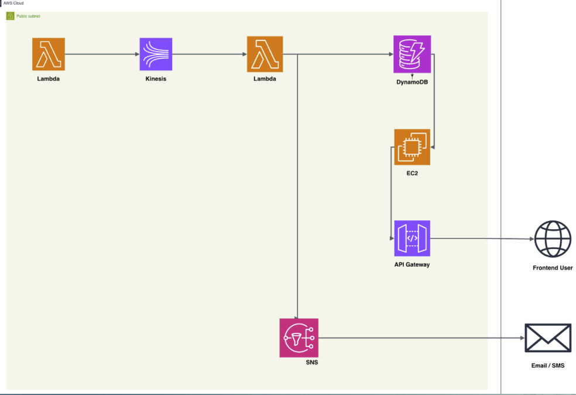
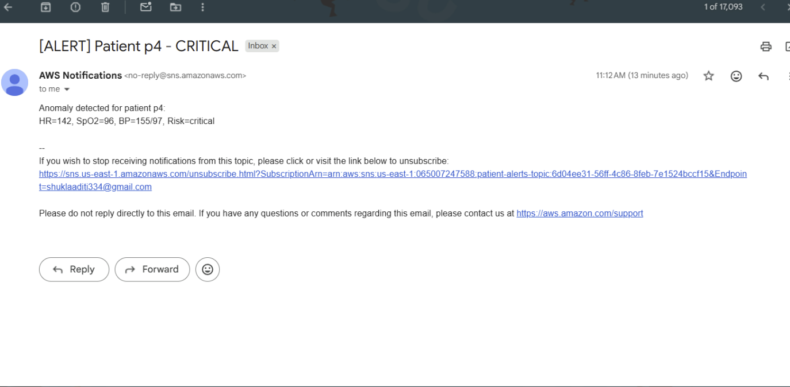

# AWS - Remote Patient Monitoring System
Real-time Remote Patient Monitoring System built on AWS.

This repository contains the architecture and implementation details for a real-time Remote Patient Monitoring System built on AWS. The system is designed to continuously ingest patient vitals, automatically detect health anomalies, and provide instant alerts to healthcare providers.

The primary objective is to build a scalable and reliable healthcare data processing pipeline that reduces manual work for hospitals through automation.

Key benefits include:
1. Early Anomaly Detection: Immediate identification of critical health events.
2. Continuous Monitoring: Real-time tracking of patient vital signs.
3. Secure Storage: Reliable and encrypted storage of sensitive patient records

**🏗️ Project Architecture**
The system utilizes a fully serverless and automated workflow on AWS.

**Data Flow:**

Data Generation: An AWS Lambda function generates synthetic patient vitals (Heart Rate, BP, SpO2, and Temperature).
Real-time Ingestion: Amazon Kinesis handles high-speed streaming of the health data.
Processing & Detection: A second Lambda function (ingest_and_anomaly) identifies critical health events based on pre-set thresholds.
Storage: All processed records are stored in Amazon DynamoDB for historical analysis.
Alerting: Critical anomalies trigger instant Email/SMS notifications via Amazon SNS.
User Access: Data is retrieved via an EC2 backend and exposed to frontend users through API Gateway.

**🛠️ AWS Services Used**

Lambda: Data generation and anomaly detection processing.
Kinesis: Real-time data streaming pipeline.
DynamoDB: Secure, scalable NoSQL storage for patient records.
SNS (Simple Notification Service): Instant alerting system for healthcare providers.
EC2 & API Gateway: Backend processing and frontend API exposure.
Nginx: High-performance web server and reverse proxy hosted on EC2.

**🚀 Features**

Automated Workflow: No manual intervention required from ingestion to alerting.
Threshold-Based Alerts: The system classifies risks as "Critical" or "Warning" based on vital signs (e.g., HR > 140 or SpO2 < 86).
Scalable Architecture: Built to handle high-throughput data using AWS managed services.

**📊 Sample Output**

When a critical anomaly is detected, the system sends an automated alert:
[ALERT] Patient p4 - CRITICAL 
Anomaly detected for patient p4 Vital Signs: HR=142, SpO2=96, BP=155/97 Risk Level: Critical

